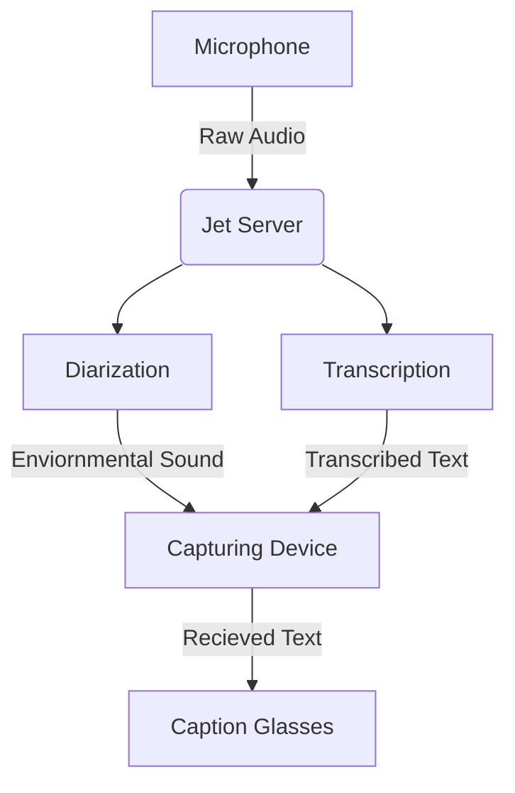

Caption Glasses are a pair of AR glasses that listen to your surroundings and display live captions directly in your field of view.

## Captioning Process
***Below is a flowchart diagram of the captioning process***


Use Python 3.12 for this (not sure what other versions work right now)


## Local Development Guide
*Docker Compose is recommended for running locally*

- Create a virtual environment in the base directory, ensure it is **Python 3.12**.
- Install necessary dependencies for the application
```sh
pip install -r dev-requirements.txt
```
- Run the Docker Compose located in the Server directory
  - If you do not have docker compose, run the port and environment vars manually.
- Wait until the webserver starts on port **8080**, this will take upwards of 4 minutes.
  - You can verify this by going to localhost:8080, if it is up, it will redirect you to the documentation.
- Mic sample rate defaults to auto-detect (`DEVICE_CAPTURE_RATE=auto` in `Local_Dev/src/.env`). Set a number only to force a specific rate.
- Once started, run the **pygame_listener.py** script located in Local_Dev/src
- If everything is correct, the transcription app should appear and connect, automatically transcribing from your microphone

## WebSocket API

Clients connect to `ws://<host>:8080/ws`. The connection carries two kinds of messages:

### Binary frames (client → server)

Raw microphone audio chunks (float32 or int16). These are processed for transcription and are not JSON.

### Text frames (client → server)

Commands are sent as one JSON object per text frame (multiple objects back-to-back in one frame are also supported). Each object must include a `"type"` field.

| `type` | Fields | Example |
|--------|--------|---------|
| `get_settings` | (none) | `{"type": "get_settings"}` |
| `set_task` | `value`: `"transcribe"` or `"translate"` | `{"type": "set_task", "value": "translate"}` |
| `set_mode` | `value`: `"balanced"`, `"soft_speech"`, `"noisy_hall"`, `"accuracy"`, or `"lyrics"` | `{"type": "set_mode", "value": "lyrics"}` |
| `set_settings` | `value`: dict of setting keys | `{"type": "set_settings", "value": {"final_beam": 4, "phrase_timeout_sec": 0.9}}` |
| `set_profanity_filter` | `value`: bool | `{"type": "set_profanity_filter", "value": true}` |
| `set_yamnet_profile` | `value`: `"default"`, `"media"`, `"quiet"`, or `"noisy"` | `{"type": "set_yamnet_profile", "value": "media"}` |
| `set_caption_telemetry` | `value`: bool | `{"type": "set_caption_telemetry", "value": true}` |

`set_mode` applies a named preset (`balanced`, `soft_speech`, `noisy_hall`, `accuracy`, `lyrics`) and **resets all settings to defaults** before applying that preset.

### Changing settings over JSON

Send a `set_settings` command with a `value` object containing one or more keys. The server replies with a `settings` message showing the full current session state.

```json
{"type": "set_settings", "value": {"phrase_timeout_sec": 1.0, "max_utterance_sec": 8}}
```

You can combine several keys in one command, or send them separately. To read the current values first:

```json
{"type": "get_settings"}
```

The pygame dev client uses the same keys for its sidebar sliders and sends `set_settings` automatically when you release a slider.

**Tip:** JSON commands should be sent as **text** WebSocket frames. Audio should be sent as **binary** frames.

### Session settings reference

Defaults below match a fresh `balanced` session. Server environment variables (e.g. `PHRASE_TIMEOUT`, `MAX_DURATION`, `WHISPER_FINAL_BEAM`, `PARTIAL_EVERY_N_CHUNKS`) can override startup defaults before any client connects.

### Whisper model (`.env`)

Set `WHISPER_MODEL` in `Server/.env` (see `Server/.env.template`). The model loads once at server start — restart after changing it. Default is `Systran/faster-distil-whisper-large-v3`.

| Model | Approx. size | Speed | Accuracy | Translate / notes |
|-------|--------------|-------|----------|-------------------|
| `tiny` / `tiny.en` | ~75 MB | Fastest | Lowest | `.en` = English-only (no translate) |
| `base` / `base.en` | ~145 MB | Very fast | Low–OK | Good for weak CPUs |
| `small` / `small.en` | ~465 MB | Fast | Decent | Solid low-latency pick |
| `medium` / `medium.en` | ~1.5 GB | Medium | Good | Strong general use |
| `large-v2` | ~3 GB | Slower | High | Multilingual + translate |
| `large-v3` | ~3 GB | Slowest | Best | Full multilingual + translate |
| `distil-large-v3` | Distilled | Very fast | High (EN) | EN-focused; weaker multilingual |
| `Systran/faster-distil-whisper-large-v3` | Distilled large | Faster than full large | Near large-v3 | **Default** — multilingual + translate; best live-caption tradeoff |

Multilingual models support `task=translate` (non-English speech → English). `*.en` models cannot. Distilled models trade a little accuracy for lower latency and VRAM.

#### Speech / caption sliders

These map to the **Live tuning** sliders in the pygame client.

| Key | UI label | Default | Range | What it does |
|-----|----------|---------|-------|--------------|
| `vad_sensitivity_boost` | Quiet speech | `0.0` | `0.0`–`0.12` | Lowers the voice-activity threshold so quieter speech is captured. Higher = more sensitive to soft voices (more false triggers in noise). |
| `phrase_timeout_sec` | Pause ends line | `0.55` | `0.35`–`1.5` | Seconds of silence that end the current caption line and flush it as `final`. Higher = longer pauses allowed within one line. |
| `max_utterance_sec` | Max line length | `6.0` | `3.0`–`14.0` | Maximum seconds of continuous speech before the server forces a line break (rolling flush). Higher = longer lines, more context for Whisper. |
| `partial_min_interval_sec` | Partial delay | `0.25` | `0.05`–`0.60` | Minimum seconds between partial (in-progress) caption updates. Lower = snappier live text, more GPU load. Partials use a trailing ~2s window (no denoise) and a stable-prefix lock so earlier words do not rewrite. |
| `partial_every_n_chunks` | Partial stride | `3` | `1`–`12` | Minimum new audio chunks between partial attempts (also gated by Partial delay). Lower = more frequent attempts. One chunk ≈ 0.13s. |
| `partial_beam` | Partial accuracy | `1` | `1`–`5` | Whisper beam width for **partial** captions. Higher = more accurate but slower live updates. |
| `final_beam` | Word accuracy | `2` | `1`–`5` | Whisper beam width for **final** captions in transcribe mode. Higher = more accurate but slower. **Translate mode currently uses beam `1` regardless of this setting.** |
| `transcribe_min_rms` | Volume floor | `0.004` | `0.001`–`0.008` | Minimum audio loudness (RMS) required before sending audio to Whisper. Higher = ignores quieter audio. |
| `segment_min_logprob_final` | Uncertain words | `-1.12` | `-1.3`–`-0.85` | Drops low-confidence words from final captions. Higher (less negative) = stricter filtering. |
| `speaker_lookback_sec` | Speaker speed | `0.35` | `0.15`–`0.75` | How far back (seconds) to look in the diarization timeline when attaching a speaker label. Lower = reacts faster to speaker changes. |
| `speaker_reset_sec` | Reset speakers | `45` | `20`–`120` | Seconds of silence before the speaker timeline resets (next speech may be labeled as speaker 1 again). |

Example — softer speech, longer lines:

```json
{"type": "set_settings", "value": {
  "vad_sensitivity_boost": 0.08,
  "phrase_timeout_sec": 0.9,
  "max_utterance_sec": 8.0,
  "final_beam": 4
}}
```

#### SFX detection sliders

These map to the **SFX detection** section in the pygame client. They tune YAMNet environmental sound labels (laughter, music, etc.), not speech transcription. Labels are filtered only by the category toggles in the sidebar (no hard-coded skip list) — turn off **People** if speech/laughter chips are noisy.

| Key | UI label | Default | Range | What it does |
|-----|----------|---------|-------|--------------|
| `yamnet_base_threshold` | SFX sensitivity | `0.38` | `0.22`–`0.72` | Base confidence required to report a sound. Lower = more sounds detected (more false positives). |
| `yamnet_music_threshold` | Music / choir | `0.48` | `0.28`–`0.75` | Threshold specifically for music/choir categories. Lower = more music detections. |
| `yamnet_secondary_min_ratio` | Extra SFX labels | `0.78` | `0.60`–`0.98` | Secondary labels must score at least this fraction of the top label’s score to be shown. Lower = more extra labels. |
| `yamnet_max_labels` | Max SFX chips | `4` | `1`–`6` | Maximum number of simultaneous SFX labels sent to the client. |
| `yamnet_denoise_strength` | SFX denoise | `0.15` | `0.0`–`0.85` | Noise reduction applied before YAMNet analysis. Higher = cleaner input for SFX (may remove quiet sounds). |

Example — more aggressive SFX detection:

```json
{"type": "set_settings", "value": {
  "yamnet_base_threshold": 0.32,
  "yamnet_music_threshold": 0.40,
  "yamnet_max_labels": 5,
  "yamnet_denoise_strength": 0.10
}}
```

Use `set_yamnet_profile` with `"media"` to apply a built-in SFX preset similar to the above without tuning each slider manually.

#### Additional settings (no pygame slider)

These are accepted by `set_settings` but are not exposed as sidebar sliders. They are set automatically by `set_mode` (e.g. `lyrics`) or can be patched directly.

| Key | Default | What it does |
|-----|---------|--------------|
| `content_mode` | `"speech"` | `"speech"` for conversation, `"lyrics"` for singing mode. Use `set_mode` with `"lyrics"` instead of setting this directly. |
| `skip_denoise` | `false` | When `true`, skips noise reduction before transcription (lyrics mode). |
| `whisper_vad_filter` | `true` | When `true`, Whisper’s internal VAD trims silence before decoding. Set `false` for lyrics mode. |
| `segment_min_logprob_partial` | `-0.9` | Confidence filter for partial captions (same idea as `segment_min_logprob_final`). |
| `segment_max_no_speech_final` | `0.82` | Drops segments Whisper thinks are non-speech (finals). Lower = stricter. |
| `segment_max_no_speech_partial` | `0.65` | Same for partial captions. |

Example — lyrics-style processing without switching the full lyrics preset:

```json
{"type": "set_settings", "value": {
  "content_mode": "lyrics",
  "skip_denoise": true,
  "whisper_vad_filter": false,
  "phrase_timeout_sec": 1.5,
  "max_utterance_sec": 14.0
}}
```

#### Mode presets

| Mode | Intended use |
|------|----------------|
| `balanced` | Default — resets all settings to baseline defaults. |
| `soft_speech` | Quiet talkers; lower volume floor, higher VAD sensitivity, wider final beam. |
| `noisy_hall` | Reverberant / noisy rooms; moderate VAD boost and stricter segment filtering. |
| `accuracy` | Slower, higher-quality finals; longer lines, higher beams, tighter speaker lookback. |
| `lyrics` | Singing; disables denoise and Whisper VAD, longer lines, music-friendly SFX thresholds. |

```json
{"type": "set_mode", "value": "accuracy"}
```

`set_settings` accepts any key from `SessionSettings` in `Server/src/core/session_settings.py`. Slider keys and labels are defined in `Local_Dev/src/client/tuning_specs.py`.

### Text frames (server → client)

| `type` | Description |
|--------|-------------|
| `partial` | In-progress caption (`text`, `speaker`, optional `language`). Server applies a stable-prefix lock so live text grows instead of rewriting earlier words. |
| `final` | Completed caption line (`text`, `speaker`, optional `language`). May include `revise: true` to replace the previous final (used when a provisional line from the last partial is corrected by Whisper). |
| `telemetry` | Noise/VAD stats (`env`, `noise_score`, `speech_prob`, `input_rms`, `capturing`, etc.) |
| `sound` | Detected environmental sounds (`text`, `labels`) |
| `settings` | Current session settings (response to `get_settings`, `set_mode`, or `set_settings`) |

When caption telemetry is enabled (`set_caption_telemetry` or server env), `partial` and `final` messages may also include `env`, `noise_score`, and `content_mode`.